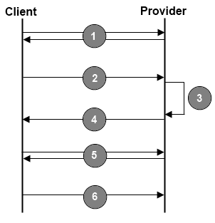

## Documentation ##

This document has as a main objective to explain how to integrate different domains, the Single Sign-on, which is defined as a single point of entry, you only need to authenticate once. This allows automatic access to multiple channels without the need to enter your login and password on each system, which provides more security to your authentication data.
We are using OAuth authorization framework enables partner application to obtain access.


### What is OAuth? ###

OAuth is an open protocol to allow secure authorization in a simple and standard method from web, mobile and desktop applications. As an application developer, services that provide HTTP APIs supporting OAuth, let you access parts of their service on behalf of your users. For example, when accessing a social network site, if your user gives you permission to access his account, you might be able to import pictures, friends lists, or contact information to your application. 

#### Some terms ####

Below contains definitions to fundamental protocol concepts referenced throughout the spec. Because understanding OAuth depends on these terms, they deserve some explanation:


* **Service Provider** – the Service Provider controls all aspects of the OAuth implementation. The Service Provider is the term used to describe the website or web-service where the restricted resources are located. It can be a photo sharing site where users keep albums, an online bank service, a microblogging site, or any other service where ‘user’s private stuff’ is kept. OAuth does not mandate that the Service Provider will also be the identity provider which means the Service Provider can use its own usernames and passwords to authenticate users, or use other systems such as OpenID.

* **User** – the user is why OAuth exists and without users, there is no need for OAuth. The users have ‘stuff’ they don’t want to make public on the Service Provider, but they do want to share it with another site. In OAuth, the protocol stops without manual interaction with the user at least once to receive permission to grant access.

* **Client** – this is a fancy name for an application trying to access the User’s resources. This can be a website, a desktop program, a mobile device, a set-top box, or anything else connected to the web. The Client is the one getting permission to access resources and the Client is where the useful part of OAuth happens. OAuth defines Client Developer’ as the entity writing code to interact with the Service Provider. 

* **Protected Resources** - the ‘stuff’ OAuth protects and allow access to. This can be data (photos, documents, contacts), activities (posting blog item, transferring funds) or any URL with a need for access restrictions.

* **Tokens** – are used instead of User credentials to access resources. A Token is generally a random string of letters and numbers (but not limited to) that is unique, hard to guess, and paired with a Secret to protect the Token from being abused. OAuth defines two different types of Tokens: Request and Access. This are explained later in greater details.


### OAuth1.0a ###

OAuth1.0a provides a method to access a protected resource at the provider, on behalf of the resource owner (the user). This process consists of the following steps:

1. The client obtains an unauthorized `request token`.
2. The client redirects the user to a login dialog at the provider.
3. The user authorizes the `request token`, associating it with their account.
4. The provider redirects the user back to the client.
5. The client exchanges the `request token` for an `access token`.
6. The `access token` allows the client to access a protected resource at the provider, on behalf of the user.



### How does it work? ###
#### DeepLink - SkyOnline to partner ####

There is a case that the client is already logged in to SkyOnline and wants to be redirected to the movie directly from the partner site.
In this case, OAuth will start from step 4(four), where Provider(SkyOnline ) will redirect the user directly to the Client(partner site) already with the necessary credentials to automatically authentication.
For the Provider to redirect the user to the right place a callback url is required to be sent the credentials that will be validated by the Client. That url is what we need to receive

ex: ```https://auth.partner.tv/sky/callback```

For the flow of OAuth to work, it is necessary for the user to be logged in SkyOnline and has permission to view the client’s contents. Given these conditions the user may be redirected to access the client’s contents.
When the user click in watch movie, the Provider will to redirect the url above with the parameters.

The Client will to validate the request token and redirect the user for the content
